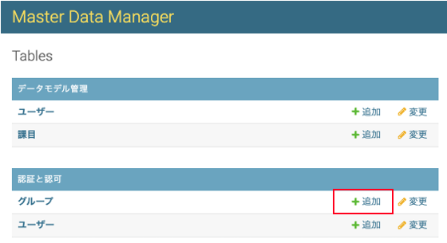
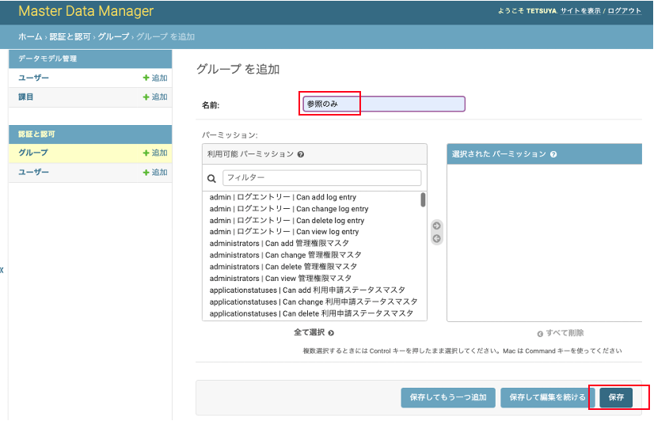
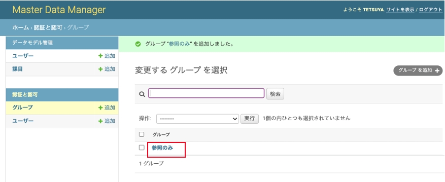
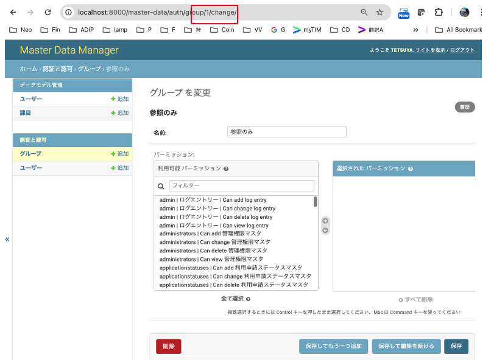

# MDM(Master Data Manager)について

## 概要

Master Data Managerでは、アプリケーションで用いられるマスタデータを登録・管理している。

* マスタデータの構造はData Model Managerにて管理が行われている。

## 機能一覧

### マスタデータの登録・編集・削除

マスタデータの種類ごとにデータのレコードを登録・編集・削除できる。  
既存レコードから値を引き継いで新規レコードを作成するコピー機能も提供している。

### マスタデータの検索

マスタデータの種類ごとにキーワード検索が可能。

### マスタデータのSQL出力

Data Model Managerの機能として登録したマスタデータをSQLとして出力することが可能。  
Master Data Managerの画面からでは出力が行えないため注意。

### レコードの編集履歴確認

マスタデータのレコードごとに誰が編集を行ったのかを確認することが可能。  
修正する際に直接Master Data ManagerのDBを更新するようなオペレーションを行った場合は履歴が残らないため注意。

### LDAPと連携したユーザ管理

Master Data Managerを利用するユーザはLDAPで連携されることを前提としている。

#### スーパーユーザ

LDAPにてスーパーユーザとして設定されたユーザは全てのマスタデータに対して編集権限を持ち、別のユーザに対して権限の付与や所属グループの設定を行うことができる。

### 編集権限の管理

（スーパーユーザのみ利用可能な機能）

マスターデータの種類ごとに追加/変更/削除/参照のパーミッションを設定可能。  
パーミッションはユーザ単位もしくはグループ単位のいずれかで設定する。

### ユーザのグループ管理

（スーパーユーザのみ利用可能な機能）

ユーザが所属可能なグループを作成することができる。  
グループに対してパーミッションを与えることで所属しているユーザ全員にパーミッションを与えることが可能。

### Data Model Managerとの連携

（ADIPのメンテナンスを行うSE向けの機能）

マスタデータに紐づくテーブルがData Model Managerで追加/変更された場合、その変更をMaster Data Managerに反映する必要がある。  
SEメンテナンスによる対応が必要であるため反映は作業依頼ベースで実施する想定。

# 開発準備

## ツールのインストール
1. Python 3.7.3のインストール
2. Gradleのインストール <https://gradle.org/>
3. Gitのインストール
4. MySQLのインストール  

## ローカル環境構築メモ(Mac)
デフォルトのpythonのバージョン  
```
python --version
Python 2.7.10
```

インストール  
```
brew install pyenv
pyenv install 3.7.3
pyenv versions

sudo easy_install pip
pip install django==4.2
brew cask install pycharm
pip install PyMySQL
pip install PyMySQL
pip install django-health-check
```

環境変数の設定  
```
vi ~/.bash_profile
export PATH=$HOME/.pyenv/shims:$HOME/.nodebrew/current/bin:$PATH
export AUTH_LDAP_BIND_PASSWORD=*****
```


# データ準備  
## 初期セットアップ時にはDjangoの管理用テーブルを生成する必要がある
以下のコマンドでテーブル作成および管理者アカウントの生成を行う  
```
export DJANGO_SETTINGS_MODULE=data_manager.settings.prod
python manage.py migrate
python manage.py createsuperuser
```

## MySQLにデータ管理対象のテーブルを作成する  
データモデル管理ツールのメニューより「MasterData DDL」を選択してDDLをダウンロードする　
```
// MySQLのPod名を取得
export POD_NAME=$(kubectl get po -l app=database -o jsonpath='{.items[0].metadata.name}')

// テーブル作成
export LANG=ja_JP.UTF-8
kubectl exec -i $POD_NAME -- mysql -umasterdata -pXXXXXX masterdata < ~/Downloads/20190425120752348_masterdata_ddl.sql
```
## MySQLに接続する場合  
```
// MySQLのPod名を取得
export POD_NAME=$(kubectl get po -l app=database -o jsonpath='{.items[0].metadata.name}')
kubectl exec -it $POD_NAME  sh
mysql -umasterdata -p masterdata
```

# アプリのデプロイ  
Masterにマージすると自動的にPodが更新される  
<https://xxx.acnshared.com/datamodel_manager/>

または以下のジョブを実行する
<https://xxx.acnshared.com/jenkins/job/deploy-sre.live.devops.masterdata_manager/>


# アプリのログを見る  
```
// pod名を取得
export POD_NAME=$(kubectl get po -l app=master-data-manager -o jsonpath='{.items[0].metadata.name}')
// ログを見る
kubectl logs -f $POD_NAME
```

# ローカルでアプリを起動する場合
```
python manage.py runserver
```
<http://localhost:8000/master-data/>


# マスタデータ管理画面の生成
データモデル管理ツールのメニューより以下のファイルを生成する  
これらのファイルを本リポジトリ内の対応ファイルに上書きする  
・./create_table.sql  
・./app/models.py  
・./app/admin.py  

create_table.sql の差分を見て、テーブル構造をAlterTable文等を利用して調整する。  

#  ローカル実行  
local.py のDB接続先設定で、ローカルPCの現在のIPアドレスを指定する。

利用プロファイル(local)を環境変数`DJANGO_ENV`に、
接続先のDBのパスワードを環境変数`APP_CONFIG_MASTERDATAMANAGERJDBCPASSWORD`を設定する。

その他必須ではない環境変数については別表を参照。
```
docker stop master-data-manager
docker rm master-data-manager
docker build -t master-data-manager:1 .
docker run -e DJANGO_ENV=local -e APP_CONFIG_MASTERDATAMANAGERJDBCPASSWORD=hoge -it --name master-data-manager -d -p 8000:8000 master-data-manager:1

http://localhost:8000/master-data/

docker logs master-data-manager
```

# 環境変数設定値
起動時に渡す環境変数で、以下の値を変更できる

| key | 説明 | 設定例 | 備考 |
| --- | --- | --- | --- |
| DJANGO_ENV | 読み込むプロファイル情報 | local | 必須項目 |
| APP_CONFIG_MASTERDATAMANAGERJDBCPASSWORD | DBのユーザーに対応するパスワード | xxx | 必須項目 |
| AUTH_LDAP_BIND_PASSWORD | LDAP認証のパスワード | xxx |  |

# ローカルにLDAP環境を構築する場合
OpenLDAP、およびその管理画面を起動する。

## docker-compose.yml
```
version: '3'

services:
  ldap-server:
    image: osixia/openldap:latest
    restart: always
    container_name: ldap-host
    environment:
      LDAP_ORGANISATION: "xxx"
      LDAP_DOMAIN: "xxx.acnshared.com"
      LDAP_ADMIN_PASSWORD: "adminpassword"
    ports:
      - "389:389"
    networks:
      - webnet

  ldap-admin:
    image: osixia/phpldapadmin:latest
    restart: always
    container_name: ldap-admin
    environment:
      PHPLDAPADMIN_LDAP_HOSTS: "ldap"
      PHPLDAPADMIN_HTTPS: "false"
    ports:
      - "8081:80"
    links:
      - "ldap-server:ldap"
    networks:
      - webnet

networks:
  webnet:
```

## 初回の起動コマンド
```
docker-compose updocker-compose up
```

## ２回目以降の起動・停止コマンド
```
docker-compose start
docker-compose stop
```

## 初期設定
### 管理コンソールにアクセス
http://localhost:8081
cn=admin,dc=xxx,dc=acnshared,dc=com / adminpassword

### グループの作成
左のツリーで create new entry here > Generic: Organisational Unit groups を作る

<Django用>
Ou=groupsの中でcreate a child entry > Generic: Posix Group
adip-active
adip-staff
adip-superuser

<ADOP用>
Ou=groupsの中でcreate a child entry > Generic: Posix Group
Default > groupOfUniqueNames
RDN = cn
cn = release-user
uniqueMember = cn=test-release,ou=people,dc=xxx,dc=acnshared,dc=com

### ユーザの作成
左のツリーで create new entry here > Generic: Organisational Unit
people を作る

Ou-=people の中で create a child entry > Generic: User Account

your.account / yourpassword (passwordは ssha)

PosixGroup adip-active > add new attribute > memberUid > your.account
PosixGroup adip-staff > add new attribute > memberUid > your.account
PosixGroup adip-speruser > add new attribute > memberUid > your.account

## 新規ユーザの「参照のみ」グループへの自動アサイン設定
- 「管理者ユーザでログインしてグループの「追加」をクリックする<br>


- 名前に「参照のみ」を入れて保存ボタンをクリックする<br>


- 作成されたグループをクリックする<br>


- グループに払い出されたIDを調べる<br>


- トリガーのスクリプトを調整して実行する<br>
https://adp001011.acnshared.com/gitlab/jp_adip/master_data_manager/-/blob/master/trigger.sql?ref_type=heads#L10	<br>
上記URLのファイルの最下行のINSERT文に指定されているIDが異なる場合は訂正した上で実行する。	
