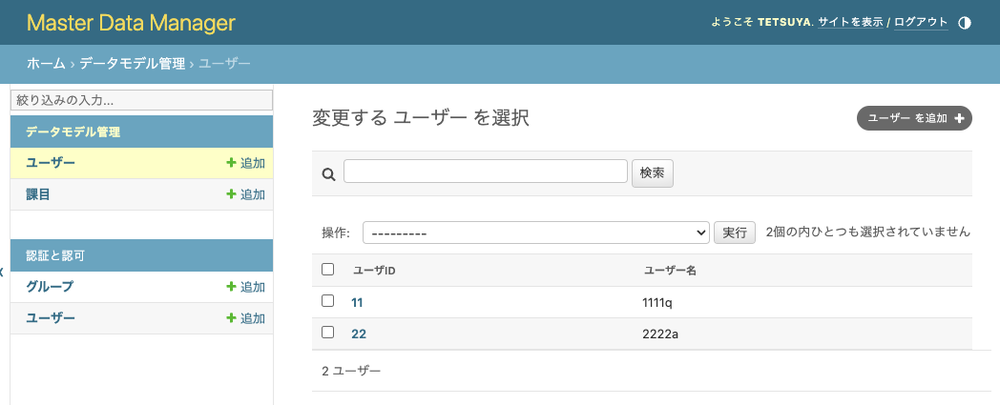
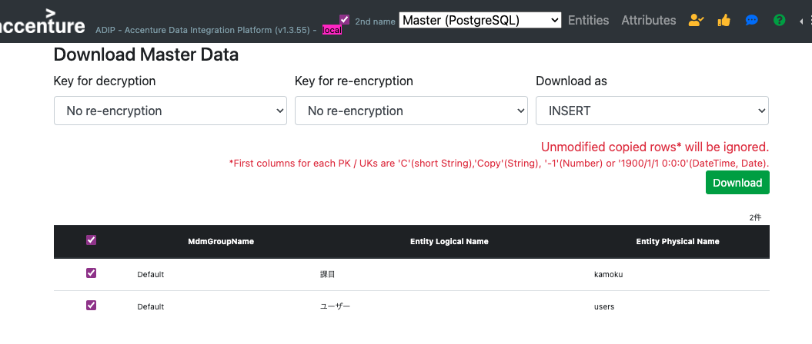
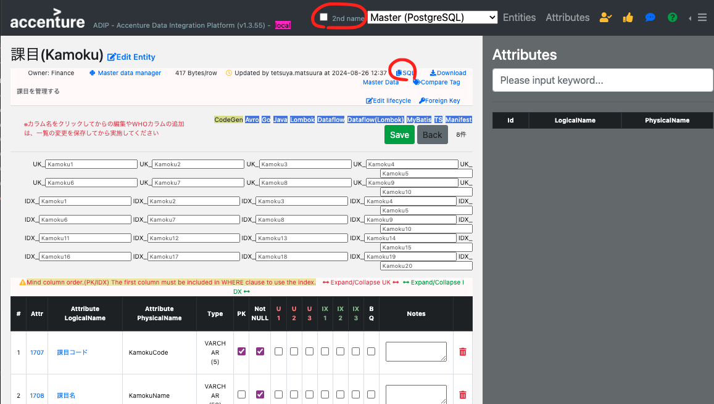
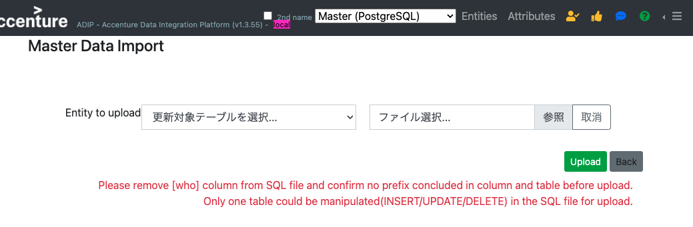

# MDMのデータのエクスポートとインポート

## エクスポート
MDMに登録されたレコードはDMMからダウンロード可能です。 
 

DMMのメニューから「Download Data」を選択するとダウンロード画面が表示されます。 
対象テーブルを選択してダウンロードします。
ダウンロード形式も選択可能ですが、全量をINSERT文でダウンロードするためには「INSERT」を選択します。 
 

## インポート
DMMからMDMへデータのインポートが可能です。 
例として、上でダウンロードしたINSERT文を加工してインポートする手順は以下の通りです。 
なお、UPDATE文、DELETE文も同じ手順で実行可能です。 

### INSERT文の加工
ダウンロードされたDMLは第二物理名を使用した形式で出力されます。 
一方で、インポートするためには第一物理名のINSERT文を用意する必要があります。 

Entity画面からINSERT文のテンプレートをダウンロード可能です。 
ヘッダの「2nd name」のチェックをOFFにして第一物理名を使用するように切り替えます。 
「SQL」のリンクをクリックするとSQL文がクリップボードに入ります。 
テキストエディタ等にペーストしてINSERT文の加工に活用してください。以下の3点の加工が必要です。 
* テーブル名、カラム名を第一物理名に置き換える。
* WHOカラムに該当するカラムとデータを除去する。
* テーブル別にファイルを分ける。
 

### ファイルのアップロード
DMMのメニューから「MasterData Import」を選択するとアップロード画面が表示されます。 
テーブルとファイルを選択して「Upload]ボタンを押下してください。 
書式に問題がある場合はエラーメッセージが表示されるのでスクリプトを修正してください。 
 

### インポートされたデータの確認
MDM画面で追加されたレコードを確認してください。

