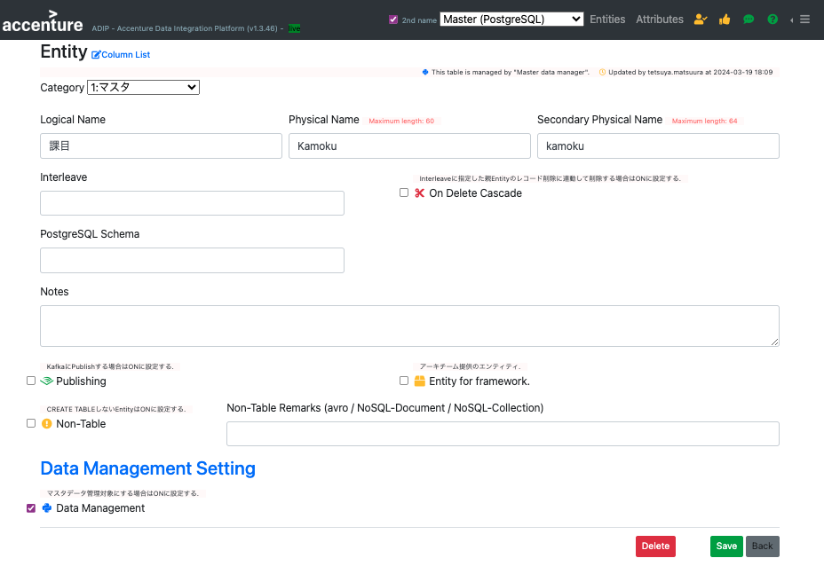
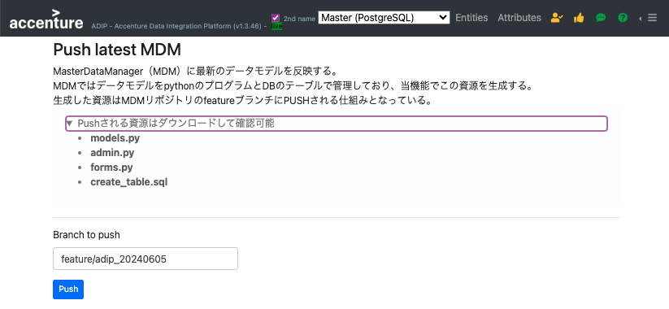
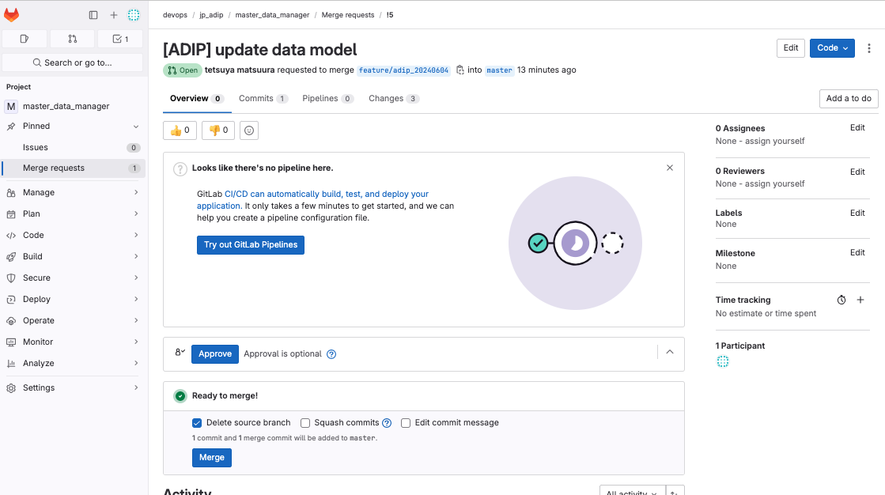
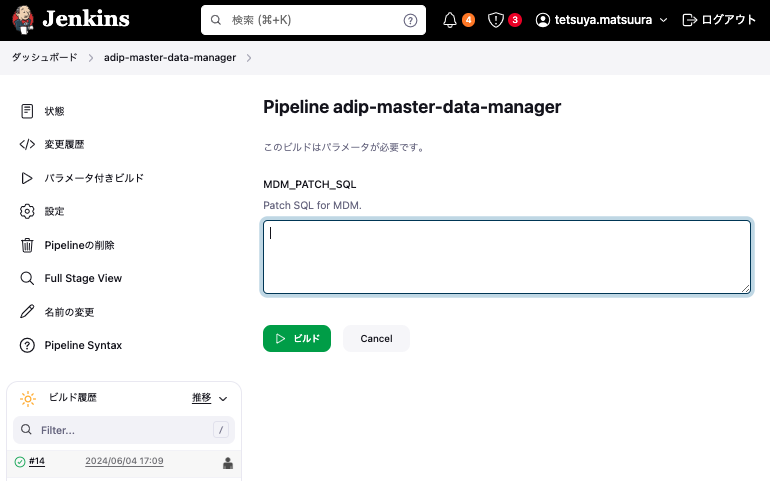

# Master Data Manager 画面更新手順

## MDM管理対象のテーブルを指定する
- Entity編集画面を開く
- Data Management Setting領域のData ManagementのチェックBOXをONに設定する
- Saveボタンをクリックして保存する

## MDMのデータ管理画面の資材を生成する
- メニューの「Push latest MDM」をクリックします。
- ブランチ名は日付を含んでいるため通常は変更不要です。
- PushボタンをクリックするとMDMの資材を管理しているGitにコードがPushされます。
- Pushされる資材を事前確認したい場合は、「models.py」「admin.py」「forms.py」「create_table.sql」をクリックすることで事前確認できます。

## GitにPushされた資材の確認とMDMのデータベースに対するDDLの準備
- ADOPのGitリポジトリにアクセスします。通常のURLは次のようになります。https://xxxxxxxxx.acnshared.com/gitlab/devops/jp_adip/master_data_manager
- 左のメニュー「Code」から「Merge Request」をクリックします。
- 「New Merge Request」をクリックします
- Source Branchに今回生成されたブランチを指定します。（例）feature/adip_20240604
- Target Branchにmasterを指定します。
- 「Compare branches and continue」をクリックします。
- 「Create merge request」をクリックします。
- 「Changes」タブをクリックすると差分を確認できます。
- 「models.py」「admin.py」「forms.py」の３ファイルについては、今回追加したテーブル、あるいは既存のテーブルに加えた変更に対する資材が生成されていることを確認してください。
- 意図せぬ変更がある場合は中断して理由を明らかにして対応してください。
- 「create_table.sql」の差分を確認してください。CREATE TABLEスクリプトのDIFFが表示されるため、テーブルの完成イメージとしての差分になっています。
- 今回追加したテーブルに関わるCREATE TABLEやCREATE TRIGGERを別途テキストエディタに貼り付けてください。
- 今回変更されたテーブルに関わるALTER TABLEスクリプトをテキストエディタに記述してください。
- Merge Requestを承認してマージしてください。

## MDM最新資材のデプロイ
- Jenkinsにアクセスします。通常のURLは次のようになります。 https://xxxxxxxxx.acnshared.com/jenkins/job/adip-master-data-manager/
- 「パラメータ付きビルド」をクリックします。
- 「Patch SQL for MDM」のテキストエリアに上でテキストエディタに作成したCREATE TABLE、CREATE TRIGGER、ALTER TABLEスクリプトを貼り付けます。
- 「ビルド」ボタンをクリックしてデプロイが正常終了することを確認します。
- コンソール出力のログを見てDDLのエラーが出ている場合は、それを訂正するDDLを作成して「パラメータ付きビルド」の手順を再実行します。
- 「Patch SQL for MDM」に貼り付けたDDLは念の為に保存して管理しておくことを推奨します。
- MDM画面にアクセスして正常に反映されたことを確認してください。
